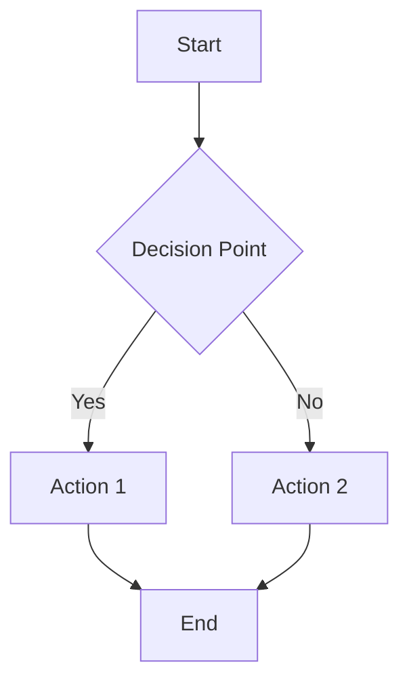

# Workflow: Workflow Manager

## Description
[Brief description of what this workflow does]

## Déclencheurs
- **Endpoint**: `[HTTP method] /api/path`
- **Event**: `[event.name]`
- **CLI**: `[command]`
- **Scheduled**: `[cron expression]`

## Composants Utilisés

### Fichiers
- `path/to/file.py:10-45` - [Description du rôle]
- `path/to/another.js:23` - [Description du rôle]

### APIs Externes
- **Service Name** (`api.example.com/endpoint`)
  - Purpose: [What it does]
  - Authentication: [API key, OAuth, etc.]

### Services Internes
- `ServiceName` - [Description]
- `RepositoryName` - [Description]

### Librairies Tierces
- `library-name` (v1.2.3) - [Usage]
- `another-lib` (v2.0.0) - [Usage]

## Flux d'Exécution

## Dépendances Métier

### Déclenche
- `workflow-name` - [When/Why]

### Requis par
- `workflow-name` - [When/Why]

### Dépend de
- `workflow-name` - [When/Why]

## Notes & Annotations

_Ajouté par @user le 2025-10-30:_
- [Note importante]
- [Point d'attention]

## Métadonnées

- **Créé le**: 2025-10-30
- **Dernière modification**: 2025-10-30
- **Auteur**: 
- **Tags**: `tag1`, `tag2`, `tag3`
- **Criticité**: `[low|medium|high|critical]`
- **Statut**: `[active|deprecated|planned]`
