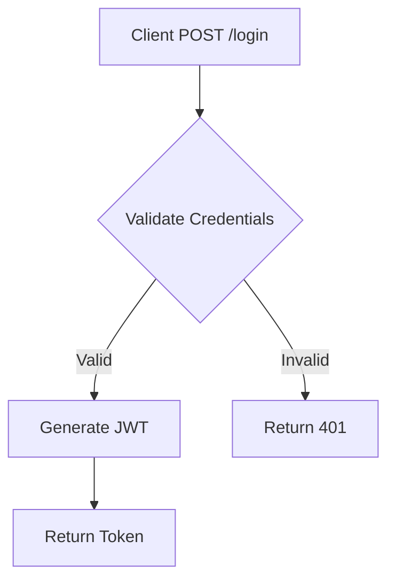

<div align="center">

# 🚀 BusLog

**Business Logic Documentation Tool**

*Visualize and document your codebase workflows with AI assistance*

[](https://www.python.org/downloads/)
[](https://opensource.org/licenses/MIT)
[](https://github.com/psf/black)
[](https://github.com/astral-sh/ruff)

[Features](#-features) •
[Installation](#-installation) •
[Quick Start](#-quick-start) •
[Documentation](#-documentation) •
[Contributing](#-contributing)

</div>

---

## 💡 What is BusLog?

BusLog is a **lightweight, language-agnostic CLI tool** that helps developers document, visualize, and understand business logic in any codebase. It leverages AI agents (Claude, Cursor, Windsurf, etc.) to automatically detect and document workflows, then presents them in an interactive web interface.

### Why BusLog?

- 📚 **Automatic Documentation**: Generate business logic docs from your codebase
- 🤖 **AI-Powered**: Works with your favorite AI coding assistant
- 🌍 **Language Agnostic**: Supports any programming language or framework
- 💾 **Git-Friendly**: All docs stored as markdown files
- 🎨 **Interactive UI**: Beautiful web interface with Mermaid diagrams
- 🚀 **Zero Lock-in**: Simple markdown files you can edit anywhere

---

## ✨ Features

### 📋 Workflow Documentation
- Automatic workflow detection via AI prompts
- Structured markdown format for each workflow
- Track files, APIs, libraries, and dependencies
- Visual flow diagrams with Mermaid.js

### 🛠️ Developer-Friendly CLI
```bash
buslog init              # Initialize in your project
buslog add <workflow>    # Create a new workflow
buslog list              # List all workflows
buslog analyze           # Generate AI analysis prompt
buslog serve             # Launch web interface
```

### 🌐 Interactive Web Interface
- Collapsible workflow sections
- Live Mermaid diagram rendering
- Annotation system for team notes
- Search and filter workflows

### 🎯 AI Integration
- Generate prompts for Claude, GPT, Gemini, etc.
- Works with Cursor, Windsurf, and other AI IDEs
- No API keys required - use your own AI assistant

---

## 📦 Installation

### Prerequisites
- Python 3.10 or higher
- pip or pipenv

### Install from source

```bash
# Clone the repository
git clone https://github.com/PoulpYBifle/AIDD-logic-metier-workflow.git
cd AIDD-logic-metier-workflow

# Install in development mode
pip install -e .

# Or install dependencies manually
pip install -r requirements.txt
```

### Verify installation

```bash
buslog version
# Output: BusLog version 0.1.0
```

---

## 🚀 Quick Start

### 1. Initialize BusLog in your project

```bash
cd your-project
buslog init --name "My Awesome Project"
```

This creates a `.business-logic/` folder with:
- `config.json` - Project configuration
- `workflows/` - Workflow documentation
- `index.md` - Main documentation page

### 2. Generate an AI analysis prompt

```bash
buslog analyze
```

Copy the generated prompt and paste it into your AI assistant (Claude, Cursor, etc.) to automatically detect workflows.

### 3. Add workflows manually (optional)

```bash
buslog add user-authentication
buslog add payment-processing
buslog add data-export
```

### 4. Launch the web interface

```bash
buslog serve
```

Open http://localhost:8080 in your browser to view and edit your workflows.

---

## 📖 Documentation

### Workflow Structure

Each workflow is documented in a markdown file with the following structure:

```markdown
# Workflow: User Authentication

## Description
Handles user authentication via JWT and OAuth2

## Déclencheurs
- **Endpoint**: `POST /api/auth/login`
- **Event**: `user.login.attempt`

## Composants Utilisés

### Fichiers
- `src/auth/controller.py:23-45` - Main auth controller
- `src/auth/jwt_service.py:10-67` - JWT token management

### APIs Externes
- **Auth0** (`auth0.com/oauth/token`) - OAuth provider
- **SendGrid** - Email verification

### Librairies Tierces
- `pyjwt` (v2.8.0) - JWT encoding/decoding
- `requests` (v2.31.0) - HTTP client

## Flux d'Exécution



## Notes & Annotations
- Rate limiting: 10 requests/minute per IP
- Tokens expire after 24 hours
```

### CLI Commands Reference

| Command | Description | Example |
|---------|-------------|---------|
| `init` | Initialize BusLog in current project | `buslog init --name "MyApp"` |
| `add` | Create a new workflow | `buslog add user-auth` |
| `list` | List all workflows | `buslog list` |
| `analyze` | Generate AI analysis prompt | `buslog analyze -o prompt.md` |
| `serve` | Start web interface | `buslog serve --port 8080` |
| `version` | Show version info | `buslog version` |

### Web Interface Features

- **Collapsible Sections**: Click workflow headers to expand/collapse
- **Live Rendering**: Markdown and Mermaid diagrams rendered in real-time
- **Annotations**: Add team notes directly in the UI
- **Search**: Filter workflows by name or content

---

## 🏗️ Project Structure

```
your-project/
├── .business-logic/           # BusLog documentation
│   ├── config.json            # Project configuration
│   ├── index.md               # Main documentation
│   ├── workflows/             # Workflow markdown files
│   │   ├── user-auth.md
│   │   ├── payment.md
│   │   └── data-export.md
│   └── annotations/           # User annotations (JSON)
│       └── user-auth.json
└── [your source code]
```

---

## 🎨 Tech Stack

- **CLI**: Python + [Typer](https://typer.tiangolo.com/) + [Rich](https://rich.readthedocs.io/)
- **Web Server**: [FastAPI](https://fastapi.tiangolo.com/) + [Uvicorn](https://www.uvicorn.org/)
- **Frontend**: Vanilla JavaScript + [Mermaid.js](https://mermaid.js.org/)
- **Storage**: Markdown + JSON (Git-friendly)
- **Code Quality**: Black, Ruff, isort, mypy

---

## 🛠️ Development

### Setup development environment

```bash
# Install dev dependencies
pip install -e ".[dev]"

# Or install dev tools manually
pip install black ruff isort mypy pytest
```

### Code Quality

```bash
# Format code
black buslog/
isort buslog/

# Lint code
ruff check buslog/

# Type check
mypy buslog/ --ignore-missing-imports

# Run tests
pytest
```

### Project adheres to:
- **Black** formatting (line-length: 100)
- **Ruff** linting (all checks passed)
- **isort** import sorting
- **Type hints** for Python 3.10+

---

## 🗺️ Roadmap

### v0.1 (Current)
- ✅ Core CLI functionality
- ✅ Workflow management (CRUD)
- ✅ AI prompt generation
- ✅ Web interface with Mermaid.js
- ✅ Annotation system

### v0.2 (Planned)
- [ ] Export to PDF/HTML
- [ ] Dependency graph visualization
- [ ] Multi-language code analysis
- [ ] Git integration (auto-detect changes)
- [ ] Workflow templates library

### v0.3 (Future)
- [ ] Multi-repo support
- [ ] Team collaboration features
- [ ] CI/CD integration
- [ ] VS Code extension
- [ ] Cloud sync (optional)

### v1.0 (Goal)
- [ ] Stable API
- [ ] Plugin system
- [ ] Advanced AI integrations
- [ ] Enterprise features

---

## 🤝 Contributing

Contributions are welcome! This project is in active development.

### How to contribute

1. **Fork the repository**
2. **Create a feature branch** (`git checkout -b feature/amazing-feature`)
3. **Commit your changes** (`git commit -m 'feat: Add amazing feature'`)
4. **Push to the branch** (`git push origin feature/amazing-feature`)
5. **Open a Pull Request**

### Commit Convention

We follow [Conventional Commits](https://www.conventionalcommits.org/):

- `feat:` New feature
- `fix:` Bug fix
- `docs:` Documentation changes
- `style:` Code style changes (formatting)
- `refactor:` Code refactoring
- `test:` Adding tests
- `chore:` Maintenance tasks

---

## 📝 License

This project is licensed under the **MIT License** - see the [LICENSE](LICENSE) file for details.

---

## 🙏 Acknowledgments

- Built with [Claude Code](https://claude.com/claude-code)
- Inspired by the need for better business logic documentation
- Thanks to the open-source community

---

## 📧 Contact

**Created by PoulpYBifle**

- Email: contact@sachapreneur.fr
- GitHub: [@PoulpYBifle](https://github.com/PoulpYBifle)

---

<div align="center">

**⭐ Star this repo if you find it useful!**

Made with ❤️ and AI assistance

</div>
