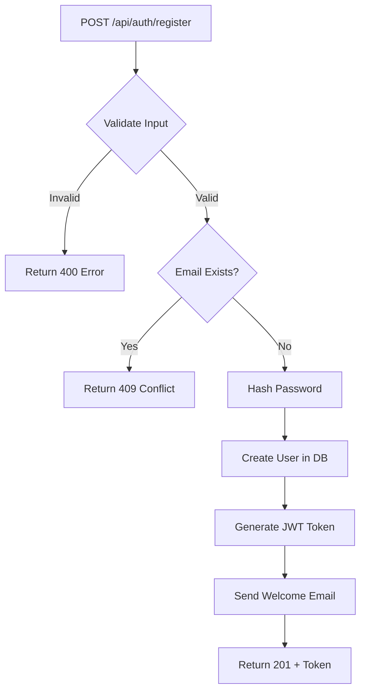

# BusLog - Business Logic Documentation Tool

**BusLog** is a language-agnostic CLI tool that helps you document and visualize business logic workflows in any codebase. It generates structured markdown documentation with interactive Mermaid diagrams and provides a beautiful web interface to explore your application's workflows.


---

## Why BusLog?

- **Language-Agnostic**: Works with any programming language (Python, JavaScript, Go, Java, etc.)
- **AI-Powered Analysis**: Generates prompts for Claude, Cursor, and other AI assistants
- **Interactive Web UI**: Beautiful tactical-themed interface with light/dark mode
- **Git-Friendly**: Stores documentation as markdown files in `.business-logic/`
- **Mermaid Diagrams**: Visual flowcharts for complex workflows
- **Team Collaboration**: Annotation system for team discussions
- **Zero Lock-In**: Just markdown files, use them anywhere

---

## Installation

### Prerequisites

- Python 3.10 or higher
- pip or pipenv

### Install from source

```bash
# Clone the repository
git clone https://github.com/PoulpYBifle/BusLog.git
cd BusLog

# Install the package
pip install -e .
```

### Verify installation

```bash
buslog --version
# or
python -m buslog.cli --version
```

---

## Quick Start

### 1. Initialize BusLog in your project

```bash
cd /path/to/your/project
buslog init --name "My Project"
```

This creates a `.business-logic/` folder with the following structure:
```
.business-logic/
├── config.json          # Project configuration
├── workflows/           # Workflow documentation (markdown)
└── annotations/         # Team annotations (JSON)
```

### 2. Add your first workflow

```bash
buslog add user-registration
```

This creates `.business-logic/workflows/user-registration.md` with a template.

### 3. Edit the workflow

Open the generated markdown file and document:
- Description (business purpose)
- Triggers (API endpoints, events, CLI commands)
- Files involved (with line numbers)
- External APIs and services
- Flow diagram (Mermaid syntax)
- Dependencies

Example:
```markdown
# Workflow: User Registration

## Description
Handles new user registration with JWT authentication and email validation.

## Déclencheurs
- **Endpoint**: `POST /api/auth/register`

## Composants Utilisés

### Fichiers
- `src/controllers/auth.controller.ts:45-120` - Registration handler
- `src/services/user.service.ts:30-80` - User creation logic
- `src/models/user.model.ts:1-50` - User data model

### APIs Externes
- **SendGrid** (`api.sendgrid.com/v3/mail/send`) - Welcome email

### Services Internes
- `AuthService` - JWT token generation
- `DatabaseService` - User persistence

### Librairies Tierces
- `bcrypt` (v5.1.0) - Password hashing
- `joi` (v17.9.0) - Input validation

## Flux d'Exécution



## Dépendances Métier
- Déclenche: `email-verification-workflow`
- Requis par: `user-login-workflow`
```

### 4. Generate AI analysis prompt

```bash
buslog analyze
```

This generates a prompt you can use with AI assistants to analyze your codebase and create workflow documentation automatically.

### 5. Start the web interface

```bash
buslog serve
```

Then open http://localhost:8080 in your browser.

**Features**:
- Browse all workflows
- Expand/collapse workflow details
- View Mermaid diagrams
- Add annotations
- Light/Dark theme switcher (top-right corner)

---

## Commands Reference

| Command | Description |
|---------|-------------|
| `buslog init [--name NAME]` | Initialize BusLog in current directory |
| `buslog add WORKFLOW_NAME` | Create a new workflow documentation |
| `buslog list` | List all documented workflows |
| `buslog analyze` | Generate AI analysis prompt |
| `buslog serve [--port PORT]` | Start web interface (default: 8080) |
| `buslog --version` | Show version |

---

## Troubleshooting

### Windows: RuntimeError with `buslog init`

**Error**:
```
RuntimeError: Type not yet supported: str | None
```

**Solution**: Use `python -m buslog.cli` instead of `buslog`:

```bash
# Instead of:
buslog init --name="My Project"

# Use:
python -m buslog.cli init --name="My Project"
```

This ensures compatibility with Typer's type system on Windows.

### Command argument parsing with spaces

**Error**:
```
Got unexpected extra argument (My Project)
```

**Solution**: Use quotes with equals sign:

```bash
# Wrong:
buslog init --name "My Project"

# Correct:
buslog init --name="My Project"

# Or omit the name (you'll be prompted):
buslog init
```

### Port already in use

**Error**:
```
OSError: [Errno 48] Address already in use
```

**Solution**: Use a different port:

```bash
buslog serve --port 8081
```

### Mermaid diagrams not rendering

**Solution**: Ensure you're using a modern browser (Chrome, Firefox, Edge). Clear cache and reload.

---

## Claude Code Integration

BusLog integrates seamlessly with Claude Code's sub-agent system.

### Use the `/buslog` command

```bash
/buslog
```

Claude will:
1. Initialize BusLog if needed
2. Analyze your codebase
3. Identify workflows (API endpoints, events, jobs)
4. Document each workflow with full details
5. Generate Mermaid diagrams
6. Present results with commands to view

### Manual skill invocation

You can also manually invoke the BusLog skill when analyzing complex workflows:

```
Claude, use BusLog to document the payment processing workflow
```

---

## Architecture

### Tech Stack

- **CLI**: [Typer](https://typer.tiangolo.com/) - Modern CLI framework
- **Terminal UI**: [Rich](https://rich.readthedocs.io/) - Beautiful formatting
- **Web Server**: [FastAPI](https://fastapi.tiangolo.com/) - High-performance API
- **ASGI Server**: [Uvicorn](https://www.uvicorn.org/) - Lightning fast
- **Templating**: [Jinja2](https://jinja.palletsprojects.com/) - Flexible templates
- **Markdown**: [Marked.js](https://marked.js.org/) - Client-side rendering
- **Diagrams**: [Mermaid.js](https://mermaid.js.org/) - Flowchart visualization

### Code Quality

- **Formatter**: Black (line-length: 100)
- **Linter**: Ruff (fast Python linter)
- **Import Sorter**: isort
- **Type Checker**: mypy

### Project Structure

```
buslog/
├── __init__.py
├── cli.py                      # CLI commands
├── core/
│   ├── workflow_manager.py     # CRUD operations
│   ├── prompt_generator.py     # AI prompt generation
│   └── analyzer.py             # Code analysis
├── web/
│   ├── server.py               # FastAPI app
│   ├── templates/
│   │   ├── index.html          # Workflow list page
│   │   └── workflow.html       # Workflow detail page
│   └── static/
│       ├── style.css           # Tactical UI theme
│       └── script.js           # Client-side logic
└── templates/
    ├── workflow.md             # Workflow markdown template
    ├── config.json             # Config template
    └── index.md                # Index template
```

---

## Contributing

Contributions are welcome! Here's how:

1. Fork the repository
2. Create a feature branch (`git checkout -b feature/amazing-feature`)
3. Make your changes
4. Run tests and linters:
   ```bash
   black buslog --check
   ruff check buslog
   isort buslog --check
   mypy buslog
   ```
5. Commit with conventional commits:
   ```bash
   git commit -m "feat: add amazing feature"
   ```
6. Push and open a Pull Request

---

## Roadmap

- [ ] Export workflows to PDF/HTML
- [ ] Workflow dependency graph visualization
- [ ] Integration with GitHub/GitLab issues
- [ ] VSCode extension
- [ ] Template customization
- [ ] Multi-language support (i18n)
- [ ] Workflow versioning and changelog
- [ ] Search and filter functionality
- [ ] API authentication and multi-user support

---

## License

MIT License - see [LICENSE](LICENSE) file for details.

---

## Author

Created by **PoulpYBifle** with [Claude Code](https://claude.com/claude-code)

- GitHub: [@PoulpYBifle](https://github.com/PoulpYBifle)
- Email: contact@sachapreneur.fr

---

## Acknowledgments

- Inspired by the need for better business logic documentation
- Built with modern Python best practices
- Designed for AI-assisted development workflows
- Tactical UI inspired by command center aesthetics

---

**Star this repo if BusLog helps your team document workflows!** ⭐
